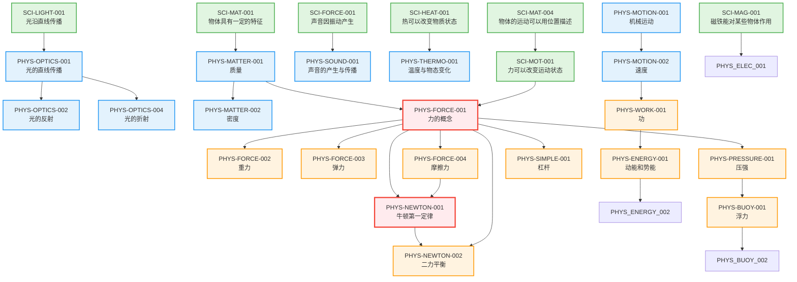
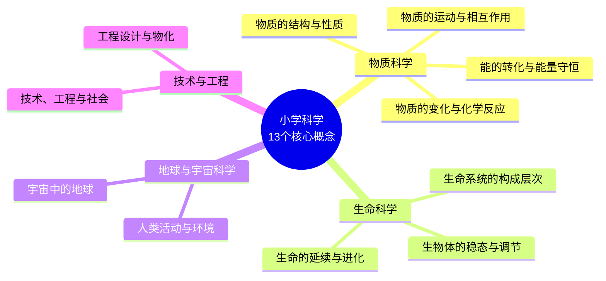
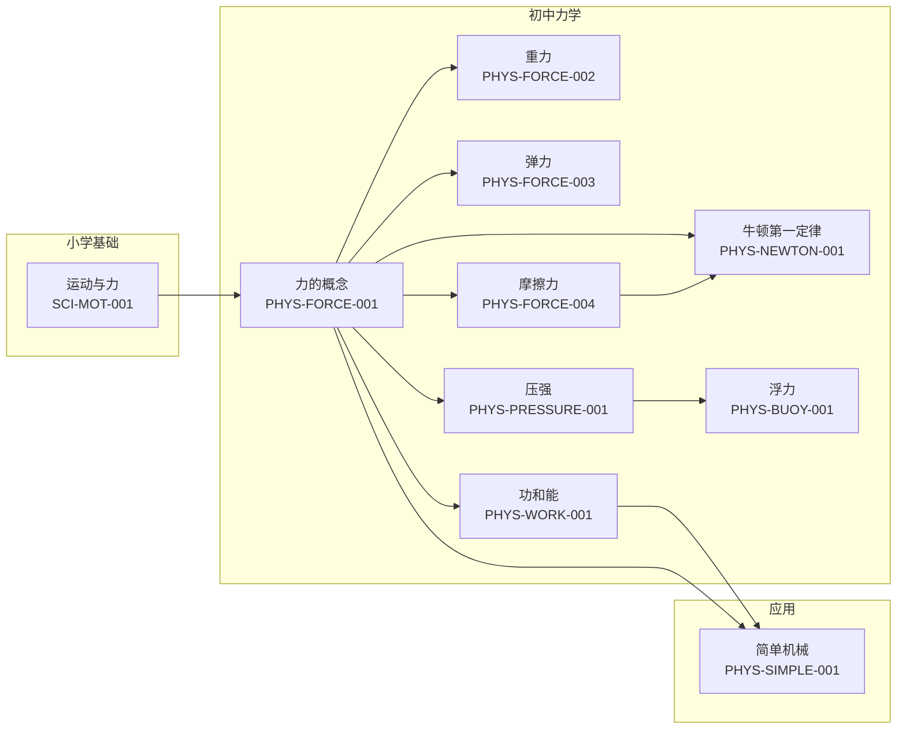
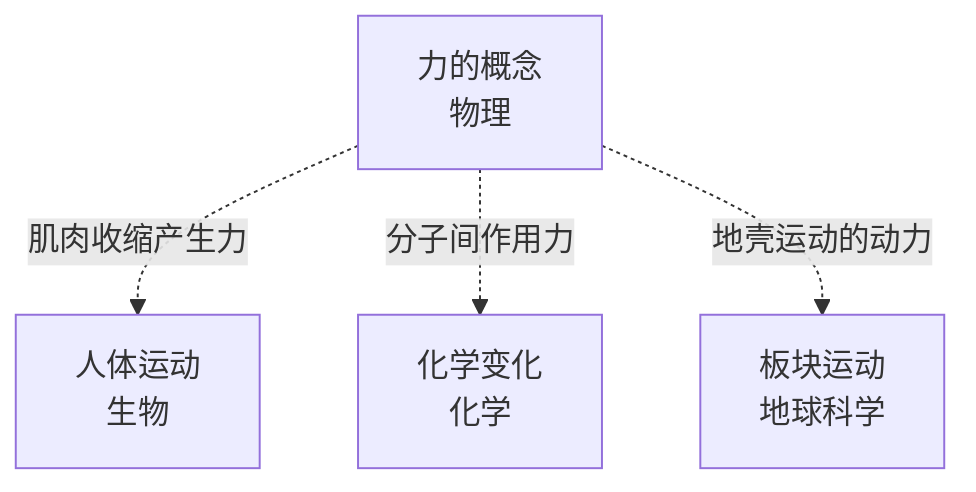

# AISTEC 知识图谱可视化

## 力学知识依赖链（Mermaid）

```mermaid
graph TD
    %% 小学科学基础
    SCI_MAT_001[SCI-MAT-001<br/>物体具有一定的特征]
    SCI_MAT_004[SCI-MAT-004<br/>物体的运动可以用位置描述]
    SCI_MOT_001[SCI-MOT-001<br/>力可以改变运动状态]
    SCI_FORCE_001[SCI-FORCE-001<br/>声音因振动产生]
    SCI_HEAT_001[SCI-HEAT-001<br/>热可以改变物质状态]
    SCI_LIGHT_001[SCI-LIGHT-001<br/>光沿直线传播]
    SCI_MAG_001[SCI-MAG-001<br/>磁铁能对某些物体作用]
    
    %% 初中八年级上
    PHYS_MOTION_001[PHYS-MOTION-001<br/>机械运动]
    PHYS_MOTION_002[PHYS-MOTION-002<br/>速度]
    PHYS_SOUND_001[PHYS-SOUND-001<br/>声音的产生与传播]
    PHYS_THERMO_001[PHYS-THERMO-001<br/>温度与物态变化]
    PHYS_OPTICS_001[PHYS-OPTICS-001<br/>光的直线传播]
    PHYS_OPTICS_002[PHYS-OPTICS-002<br/>光的反射]
    PHYS_OPTICS_004[PHYS-OPTICS-004<br/>光的折射]
    PHYS_MATTER_001[PHYS-MATTER-001<br/>质量]
    PHYS_MATTER_002[PHYS-MATTER-002<br/>密度]
    
    %% 初中八年级下 - 力学核心
    PHYS_FORCE_001[PHYS-FORCE-001<br/>力的概念]
    PHYS_FORCE_002[PHYS-FORCE-002<br/>重力]
    PHYS_FORCE_003[PHYS-FORCE-003<br/>弹力]
    PHYS_FORCE_004[PHYS-FORCE-004<br/>摩擦力]
    PHYS_NEWTON_001[PHYS-NEWTON-001<br/>牛顿第一定律]
    PHYS_NEWTON_002[PHYS-NEWTON-002<br/>二力平衡]
    PHYS_PRESSURE_001[PHYS-PRESSURE-001<br/>压强]
    PHYS_BUOY_001[PHYS-BUOY-001<br/>浮力]
    PHYS_WORK_001[PHYS-WORK-001<br/>功]
    PHYS_ENERGY_001[PHYS-ENERGY-001<br/>动能和势能]
    PHYS_SIMPLE_001[PHYS-SIMPLE-001<br/>杠杆]
    
    %% 依赖关系
    SCI_MAT_004 --> SCI_MOT_001
    SCI_MOT_001 --> PHYS_FORCE_001
    SCI_MAT_001 --> PHYS_MATTER_001
    SCI_LIGHT_001 --> PHYS_OPTICS_001
    SCI_FORCE_001 --> PHYS_SOUND_001
    SCI_HEAT_001 --> PHYS_THERMO_001
    SCI_MAG_001 --> PHYS_ELEC_001
    
    PHYS_MATTER_001 --> PHYS_MATTER_002
    PHYS_MATTER_001 --> PHYS_FORCE_001
    PHYS_MOTION_001 --> PHYS_MOTION_002
    PHYS_MOTION_002 --> PHYS_WORK_001
    PHYS_OPTICS_001 --> PHYS_OPTICS_002
    PHYS_OPTICS_001 --> PHYS_OPTICS_004
    
    PHYS_FORCE_001 --> PHYS_FORCE_002
    PHYS_FORCE_001 --> PHYS_FORCE_003
    PHYS_FORCE_001 --> PHYS_FORCE_004
    PHYS_FORCE_001 --> PHYS_NEWTON_002
    PHYS_FORCE_001 --> PHYS_PRESSURE_001
    PHYS_FORCE_001 --> PHYS_SIMPLE_001
    
    PHYS_FORCE_004 --> PHYS_NEWTON_001
    PHYS_FORCE_001 --> PHYS_NEWTON_001
    PHYS_PRESSURE_001 --> PHYS_BUOY_001
    PHYS_BUOY_001 --> PHYS_BUOY_002
    PHYS_WORK_001 --> PHYS_ENERGY_001
    PHYS_ENERGY_001 --> PHYS_ENERGY_002
    
    PHYS_NEWTON_001 --> PHYS_NEWTON_002
    
    %% 样式
    classDef primary fill:#e1f5e1,stroke:#4caf50,stroke-width:2px
    classDef junior8u fill:#e3f2fd,stroke:#2196f3,stroke-width:2px
    classDef junior8d fill:#fff3e0,stroke:#ff9800,stroke-width:2px
    classDef core fill:#ffebee,stroke:#f44336,stroke-width:3px
    
    class SCI_MAT_001,SCI_MAT_004,SCI_MOT_001,SCI_FORCE_001,SCI_HEAT_001,SCI_LIGHT_001,SCI_MAG_001 primary
    class PHYS_MOTION_001,PHYS_MOTION_002,PHYS_SOUND_001,PHYS_THERMO_001,PHYS_OPTICS_001,PHYS_OPTICS_002,PHYS_OPTICS_004,PHYS_MATTER_001,PHYS_MATTER_002 junior8u
    class PHYS_FORCE_001,PHYS_FORCE_002,PHYS_FORCE_003,PHYS_FORCE_004,PHYS_NEWTON_001,PHYS_NEWTON_002,PHYS_PRESSURE_001,PHYS_BUOY_001,PHYS_WORK_001,PHYS_ENERGY_001,PHYS_SIMPLE_001 junior8d
    class PHYS_NEWTON_001,PHYS_FORCE_001 core
```

## 小学科学核心概念地图

```mermaid
mindmap
  root((小学科学<br/>13个核心概念))
    物质科学
      物质的结构与性质
      物质的变化与化学反应
      物质的运动与相互作用
      能的转化与能量守恒
    生命科学
      生命系统的构成层次
      生物体的稳态与调节
      生命的延续与进化
    地球与宇宙科学
      宇宙中的地球
      人类活动与环境
    技术与工程
      技术、工程与社会
      工程设计与物化
```

## 物理力学概念层级

```mermaid
graph LR
    subgraph 小学基础
    A[运动与力<br/>SCI-MOT-001]
    end
    
    subgraph 初中力学
    B[力的概念<br/>PHYS-FORCE-001]
    C[重力<br/>PHYS-FORCE-002]
    D[弹力<br/>PHYS-FORCE-003]
    E[摩擦力<br/>PHYS-FORCE-004]
    F[牛顿第一定律<br/>PHYS-NEWTON-001]
    G[压强<br/>PHYS-PRESSURE-001]
    H[浮力<br/>PHYS-BUOY-001]
    I[功和能<br/>PHYS-WORK-001]
    end
    
    subgraph 应用
    J[简单机械<br/>PHYS-SIMPLE-001]
    end
    
    A --> B
    B --> C
    B --> D
    B --> E
    B --> F
    B --> G
    E --> F
    G --> H
    B --> I
    I --> J
    B --> J
```

## 跨学科连接示例

```mermaid
graph TD
    PHYS_FORCE_001[力的概念<br/>物理]
    BIO_BODY_001[人体运动<br/>生物]
    CHEM_REACT_001[化学变化<br/>化学]
    EARTH_PLATE_001[板块运动<br/>地球科学]
    
    PHYS_FORCE_001 -.->|肌肉收缩产生力| BIO_BODY_001
    PHYS_FORCE_001 -.->|分子间作用力| CHEM_REACT_001
    PHYS_FORCE_001 -.->|地壳运动的动力| EARTH_PLATE_001
```
